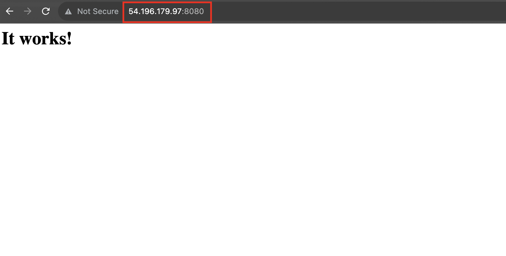
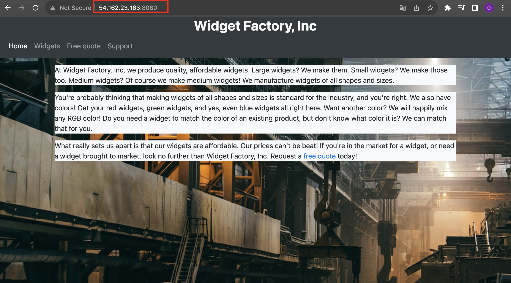
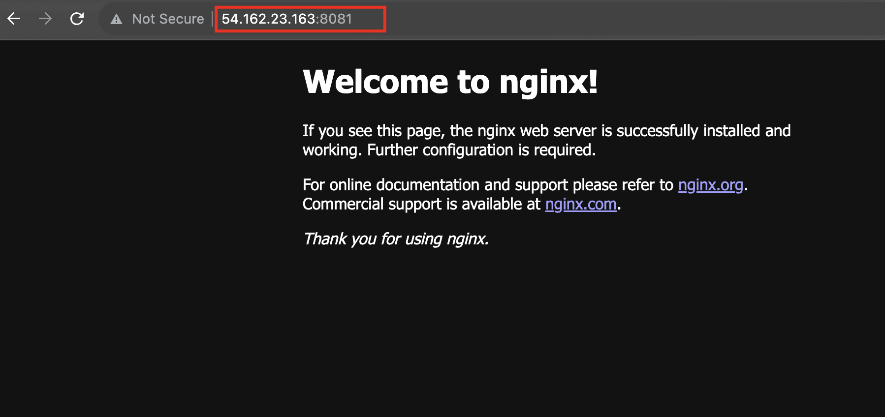
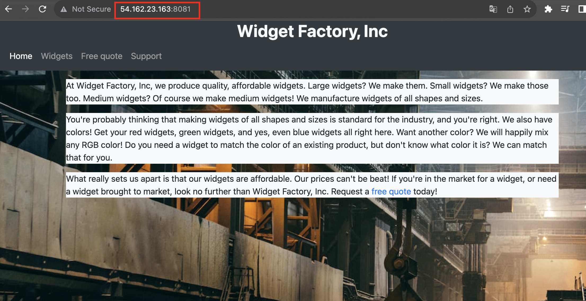

## HTTPD

1. Pull httpd:2.4 image from docker hub
```
docker pull httpd:2.4
```

2. Run a container named `httpd` from the httpd image. Map server port `8080`, to port `80` in the container.
```
docker run --name httpd -p 8080:80 -d httpd:2.4
```

3. Verify if httpd webserver is running
`http://{Public_IP_Address}:8080`



4. Clone an existing website code onto the server
```
git clone https://github.com/linuxacademy/content-widget-factory-inc.
```

5. Stop and delete your currently running httpd container.
```
docker stop {container-name}
docker rm {containaer-name}
```

6. Create a new httpd container, mount the website data, and map the port.
```
cd content-widget-factory-inc
ll
cd web

docker run --name httpd -p 8080:80 -v $(pwd):/usr/local/apache2/htdocs:ro -d httpd:2.4
```

7. Verify if the website is displaying
`http://{Public_IP_Address}:8080`



## NGINX

1. Pull the latest nginx image from docker hub
```
docker pull nginx
```

2. Run a container named `httpd` from the httpd image. Map server port `8081`, to port `80` in the container.
```
docker run --name nginx -p 8081:80 -d nginx
```

3. Verify if httpd webserver is running
`http://{Public_IP_Address}:8081`



4. Stop and delete your currently running httpd container.
```
docker stop {container-name}
docker rm {containaer-name}
```

6. Create a new httpd container, mount the website data, and map the port.
```
cd content-widget-factory-inc
ll
cd web

docker run --name nginx -v $(pwd):/usr/share/nginx/html:ro -p 8081:80 -d nginx
```

7. Verify if the website is displaying
`http://{Public_IP_Address}:8081`

